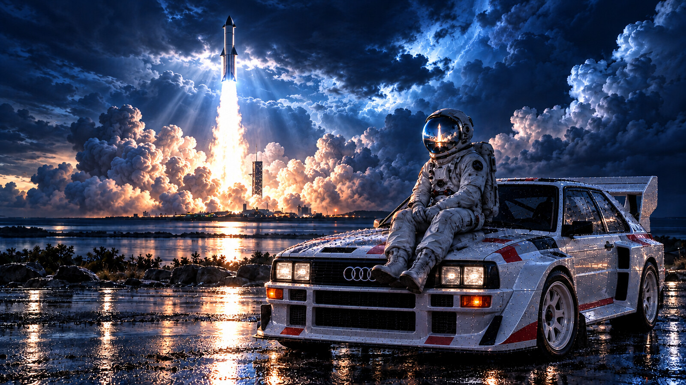

# Starship Quattro - Omarchy Theme

A midnight-blue Omarchy theme pairing a dramatic Starship launch with an astronaut and a classic Audi rally quattro. Ice-cyan accents, silver text and restrained launch-amber highlights complement the wallpaper.



## Install

```bash
omarchy-theme-install https://github.com/MrJazzMan/omarchy-starship-quattro-RS-theme.git
```

Or open the Omarchy menu, choose **Install > Theme**, and paste the repository URL. The repository name installs as `starship-quattro-rs`.

## Included

- Full 6K WebP wallpaper: **6144 × 3456**, 16:9, in `backgrounds/`.
- Semantic `colors.toml` for current Omarchy template generation.
- Application configurations based on Osaka Jade for Alacritty, Ghostty, Kitty, btop, Hyprland, Hyprlock, Mako, SwayOSD, Walker and Waybar.
- Neovim palette configuration and a Tokyo Night VS Code theme selection.
- Lightweight wallpaper preview. This is an artwork preview, not a screenshot of a running desktop.

The 6K wallpaper is an AI-generated concept image upscaled using Lanczos resampling; it is not a real launch photograph or native 6K render. No desktop runtime screenshot is included.

## Palette

| Role | Colour |
| --- | --- |
| Background | `#091321` |
| Foreground | `#DCE8F5` |
| Accent | `#7CCBFF` |
| Selection | `#233E5B` |
| Blue | `#6CA8EF` |
| Cyan | `#73D8EE` |
| Launch amber | `#F4A261` |

## Compatibility

Prepared against the current Omarchy source and the Osaka Jade application layout. Static configuration and palette checks pass; live installation has not been tested on an Omarchy desktop. Current Omarchy generates additional application settings from `colors.toml`; older releases use the bundled configurations. VS Code uses the named extension's palette. Icon selection requires `Yaru-blue` to be available.

## Credits and licensing

- Configuration layout adapted from [Justikun / Osaka Jade](https://github.com/Justikun/omarchy-osaka-jade-theme), MIT, copyright Justin Lowry. Upstream notice retained in `LICENSE`.
- Neovim configuration derived from [Omarchy's theme template](https://github.com/basecamp/omarchy), MIT, copyright David Heinemeier Hansson. Notice retained in `LICENSE.omarchy`.
- Wallpaper created for Miguel Lopes Garcia with ChatGPT, then upscaled to 6K. Artwork is included under the MIT terms in `LICENSE`, to the extent applicable rights exist.

Independent community theme; no affiliation with or endorsement by Audi or SpaceX. Brand marks remain the property of their respective owners.
